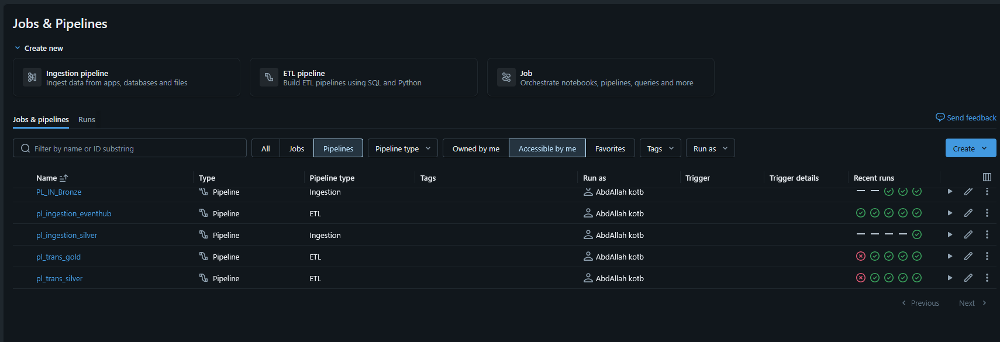
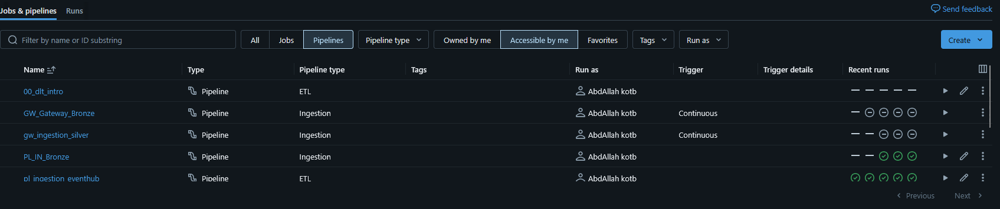
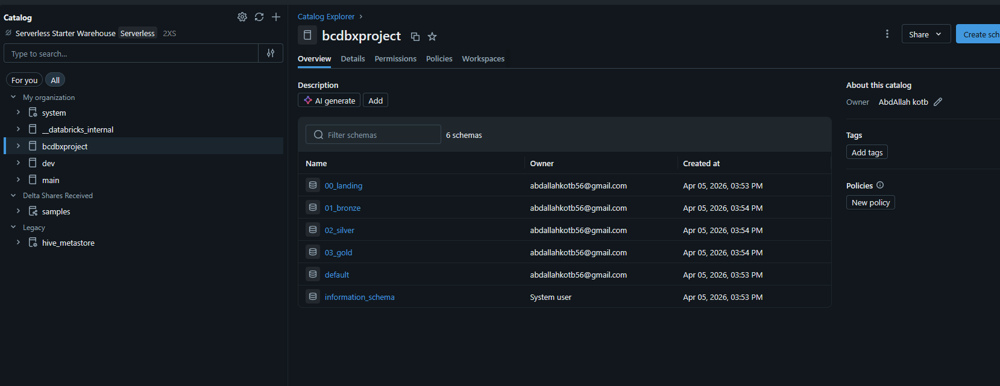
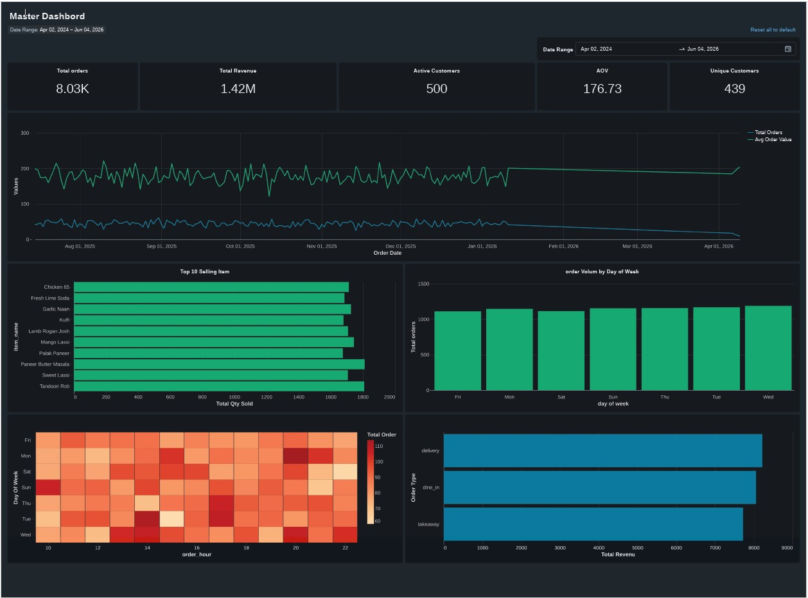

# 🍽️ Restaurant Chain Analytics — End-to-End Databricks Lakehouse

An end-to-end data engineering project on **Azure Databricks** that ingests operational restaurant data from multiple sources, processes it through a **Medallion architecture** (Bronze → Silver → Gold) using **Lakeflow Declarative Pipelines (DLT)** and **Unity Catalog**, and serves insights through **Databricks AI/BI dashboards**.

Built as a portfolio project to demonstrate a production-style Lakehouse implementation covering batch CDC ingestion, real-time streaming, data quality enforcement, dimensional modeling, and BI.


---

## 📌 Project Highlights

- **Multi-source ingestion** — Azure SQL Database (CDC via Lakeflow Connect), Azure Data Lake Storage (historical CSVs), and Azure Event Hubs (real-time order stream via Kafka connector).
- **Medallion architecture** on Unity Catalog with four schemas: `00_landing`, `01_bronze`, `02_silver`, `03_gold`.
- **Declarative pipelines (DLT / SDP)** using `@dp.table`, `@dp.materialized_view`, and `@dp.expect_all_or_drop` data-quality expectations.
- **Change Data Capture (CDC)** from SQL Server via a Lakeflow Connect **Ingestion Gateway** with a Minimal Compute Policy.
- **Streaming ingestion** from Event Hubs into bronze using Structured Streaming.
- **Dimensional modeling** in silver/gold: fact tables (orders, order items, reviews) and conformed dimensions (customers, restaurants, menu items).
- **Customer 360** materialized view joining orders, items, and reviews for analytics and ML.
- **AI/BI Dashboards** — Master Performance dashboard and Review Insights dashboard built directly on gold tables.

---

## 🏗️ Architecture

**Flow:** Sources → Landing → Bronze → Silver → Gold → BI

| Layer | Purpose | Tech |
|---|---|---|
| **Sources** | Azure SQL DB (customers, restaurants, menu_items, orders), ADLS (historical_orders.csv, reviews), Event Hub (live orders) | Azure SQL, ADLS Gen2, Event Hubs |
| **00_landing** | Raw CDC/staging tables from the ingestion gateway | Unity Catalog managed tables |
| **01_bronze** | Raw-but-typed append tables (one-to-one with sources) | Delta, Auto Loader, Structured Streaming |
| **02_silver** | Cleaned, conformed, deduplicated facts & dimensions with DQ expectations | DLT (SDP), PySpark |
| **03_gold** | Business aggregates, Customer 360, sales summaries | DLT materialized views |
| **BI** | Master Dashboard + Review Insights Dashboard | Databricks AI/BI |

---

## 🗂️ Repository Structure

```
databricks-e2e-project/
├── 00_synthetic_data/              # Generate realistic source data
│   ├── 00_sql_db.py                # Seed Azure SQL DB
│   ├── 01_historical_orders.py     # Generate historical_orders.csv
│   ├── 02_reviews.py               # Generate review data
│   ├── 03_run.py                   # Orchestrator
│   ├── 04_eventhub_orders.py       # Stream synthetic orders to Event Hubs
│   ├── data/                       # Sample CSVs
│   └── sql/                        # DDL + schema docs
│
├── 01_pipelines/
│   ├── pipeline_ingest_eventhub.py           # Event Hub → bronze (Kafka)
│   └── pipeline_bronze_to_gold/
│       ├── silver/
│       │   ├── fact_orders.py                # Orders fact w/ DQ expectations
│       │   ├── fact_order_items.py           # Exploded order-line fact
│       │   └── fact_reviews.sql              # Reviews fact (SQL DLT)
│       └── gold/
│           ├── d_customer_360.py             # Customer 360 materialized view
│           ├── d_sales_summary.py            # Daily sales summary
│           └── d_restaurant_reviews.py       # Restaurant-level reviews
│
├── diagrams/
├── screenshots/                    # Workspace captures + dashboard PDF
├── commands_used.md                # CLI, CDC test SQL, event_log queries
├── dashboard_metrics.md            # Dashboard KPIs and charts
└── README.md
```

---

## 🔌 Pipelines

Seven Databricks pipelines orchestrate the full flow:

| Pipeline | Type | Description |
|---|---|---|
| `GW_Gateway_Bronze` | Ingestion (Continuous) | Lakeflow Connect Gateway from Azure SQL Server |
| `gw_ingestion_silver` | Ingestion (Continuous) | CDC applier writing into landing/bronze |
| `PL_IN_Bronze` | Ingestion | Batch load of historical CSVs into bronze |
| `pl_ingestion_eventhub` | ETL (Streaming) | Event Hubs → bronze via Kafka connector |
| `pl_ingestion_silver` | Ingestion | Raw → silver standardization |
| `pl_trans_silver` | ETL | Bronze → silver facts/dims with DQ expectations |
| `pl_trans_gold` | ETL | Silver → gold aggregates, Customer 360 |




### Unity Catalog Layout

Catalog `bcdbxproject` organized into six schemas (`00_landing`, `01_bronze`, `02_silver`, `03_gold`, `default`, `information_schema`):



---

## ✅ Data Quality

Silver tables enforce expectations using DLT's `@dp.expect_all_or_drop`. Example from `fact_orders`:

```python
@dp.expect_all_or_drop({
    "valid_order_id"        : "order_id is not null",
    "valid_order_timestamp" : "order_timestamp is not null",
    "valid_customer_id"     : "customer_id is not null",
    "valid_restaurant_id"   : "restaurant_id is not null",
    "valid_item_count"      : "item_count > 0",
    "valid_total_amount"    : "total_amount > 0",
    "valid_payment_method"  : "payment_method in ('cash','card','wallet')",
    "valid_order_status"    : "order_status in ('completed','delivered','ready','pending','preparing','confirmed')"
})
```

Records that violate any expectation are dropped before reaching silver, guaranteeing gold-layer trust.

---

## 📡 Streaming Ingestion (Event Hubs)

Real-time orders are published to Azure Event Hubs and consumed into bronze via the Kafka protocol:

```python
KAFKA_OPTIONS = {
    "kafka.bootstrap.servers": f"{EH_NAMESPACE}.servicebus.windows.net:9093",
    "subscribe": EH_NAME,
    "kafka.sasl.mechanism": "PLAIN",
    "kafka.security.protocol": "SASL_SSL",
    "kafka.sasl.jaas.config": f'...PlainLoginModule required username="$ConnectionString" password="{EH_CONN_STR}";',
}
```

Pipeline parameters (`eh.namespace`, `eh.name`, `eh.connectionString`) are passed via `spark.conf` so no secrets live in code.

---

## 🔄 CDC from SQL Server

The ingestion gateway was deployed with a Minimal Compute Policy via the Databricks CLI:

```bash
databricks pipelines update <pipeline_id> --json '{
  "name": "gw_ingestion_silver",
  "catalog": "ws_dbxproject",
  "schema": "00_landing",
  "gateway_definition": {
    "connection_name": "conn_restaurantops",
    "gateway_storage_catalog": "ws_dbxproject",
    "gateway_storage_schema": "00_landing",
    "gateway_storage_name": "gw_ingestion_silver"
  },
  "clusters": [{ "label": "default", "policy_id": "000ED73F24A01A46", "apply_policy_default_values": true }],
  "continuous": true
}'
```

CDC behaviour was validated with live SQL inserts/updates on the source — see [`commands_used.md`](commands_used.md).

---

## 📊 BI — Master Dashboard

Gold tables feed a Databricks AI/BI Master Dashboard with date-range filtering:

| KPI | Value |
|---|---|
| Total Orders | **8.03K** |
| Total Revenue | **1.42M** |
| Active Customers | **500** |
| AOV | **176.73** |
| Unique Customers | **439** |

Charts: daily orders & AOV trend, top 10 selling items, order volume by day of week, peak-hour heatmap (day × hour), and revenue by order type (delivery / dine_in / takeaway).

A second **Review Insights Dashboard** tracks review volume, rating distribution, sentiment trend, and issue categorization (delivery, food quality, pricing, portion size).



📄 Full PDF export: [`screenshots/master_dashboard.pdf`](screenshots/master_dashboard.pdf)
---

## 🛠️ Tech Stack

- **Cloud:** Azure (SQL Database, ADLS Gen2, Event Hubs)
- **Lakehouse:** Azure Databricks, Unity Catalog, Delta Lake
- **Pipelines:** Lakeflow Declarative Pipelines (DLT / SDP), Lakeflow Connect, Structured Streaming
- **Languages:** PySpark, SQL, Python
- **BI:** Databricks AI/BI Dashboards
- **Tooling:** Databricks CLI, Git

---

## 🚀 How to Run

1. **Provision Azure resources:** Azure SQL Database, ADLS Gen2 storage account, and an Event Hubs namespace.
2. **Seed synthetic data:** run the scripts in `00_synthetic_data/` in order (`03_run.py` orchestrates the batch generators; `04_eventhub_orders.py` streams live orders).
3. **Create Unity Catalog** `bcdbxproject` and the four schemas.
4. **Create the Lakeflow Connect connection** to Azure SQL and deploy the ingestion gateway (see `commands_used.md`).
5. **Deploy the DLT pipelines** from `01_pipelines/` — silver and gold pipelines reference `bcdbxproject.01_bronze.*` and `bcdbxproject.02_silver.*`.
6. **Build dashboards** on the gold tables using the metrics in `dashboard_metrics.md`.

---

## 📚 Key Learnings

- Wiring **Lakeflow Connect** end-to-end for SQL Server CDC into a managed gateway pipeline.
- Designing **idempotent streaming ingestion** from Event Hubs using the Kafka connector and `spark.conf` parameterization.
- Enforcing **data quality contracts** inline via DLT expectations rather than post-hoc checks.
- Building **Customer 360** as a materialized view over conformed silver facts.
- Operating the Lakehouse with **Unity Catalog governance** and **event_log** queries for pipeline observability.

---

## 👤 Author

**Abdallah Kotb (Kotb)** — Senior Data Engineer · Manchester, UK
Azure · Databricks · Snowflake · PySpark · SQL · Power BI

> If this project is useful to you, a ⭐ on the repo is much appreciated.
=======
# databricks-e2e-restaurant-analytics
 Restaurant Chain Analytics — End-to-End Databricks Lakehouse
